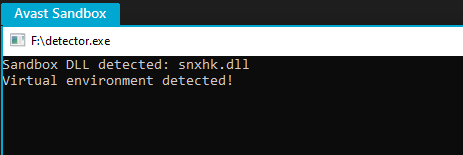
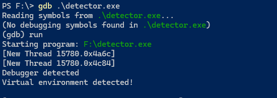
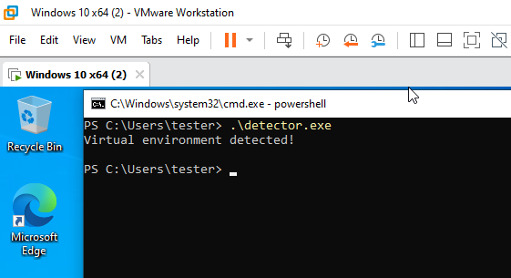
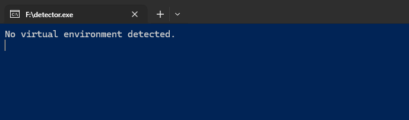

# SafeZoneDetector

The `SafeZoneDetector` library is designed to detect if the current environment is a sandbox, emulator, or virtual machine. This can be useful for security applications where you need to ensure that your software is running in a trusted environment.

## Features

- Detects if the environment is a sandbox.
  
  
- Detects if the environment is an emulator.
- Detects if the environment is a debugger.
  
  
- Detects if the environment is a virtual machine.
  
  
- Provides a unified method to check for any virtual environment.

  

## Usage

### 1. Include the Header

Include the `SafeZoneDetector.h` header file in your project:

```cpp
#include "SafeZoneDetector.h"
```

### 2. Initialize the detector

Initialize the detector class preferably at the begginig of the main function:


```cpp
SafeZoneDetector detector;
```

### 3. Use the library

Use the library methods to check for emulators, sandboxes of virtual machines.

```cpp
// Check for any virtual environment
if (detector.isAnyVirtualEnvironment()) {
    std::cout << "Virtual environment detected!" << std::endl;
} else {
    std::cout << "No virtual environment detected." << std::endl;
}

// Check for sandboxed environment
if (detector.isSandboxed()) {
    std::cout << "Sandboxed environment detected!" << std::endl;
} else {
    std::cout << "No Sandboxed environment detected." << std::endl;
}

// Check for emulator
if (detector.isEmulator()) {
    std::cout << "Emulator environment detected!" << std::endl;
} else {
    std::cout << "No Emulator environment detected." << std::endl;
}

// Check for debugger
if (detector.isDebuggerPresentCheck()) {
    std::cout << "Debugger environment detected!" << std::endl;
} else {
    std::cout << "No debugger environment detected." << std::endl;
}

// Check for virtual machine presence
if (detector.isVirtualMachine()) {
    std::cout << "Virtual Machine environment detected!" << std::endl;
} else {
    std::cout << "No Virtual Machine environment detected." << std::endl;
}
```

### 4. Compile the binary

Compile the binary with g++ and std C11
```bash
g++ .\main.cpp -o detector.exe -Wall -Wextra -std=c++11
```


### (optional) Strip the symbols and selections
Remove all symbol and relocation information to make the binary smaller and harder to analyze

```bash
strip.exe .\detector.exe -s
```
